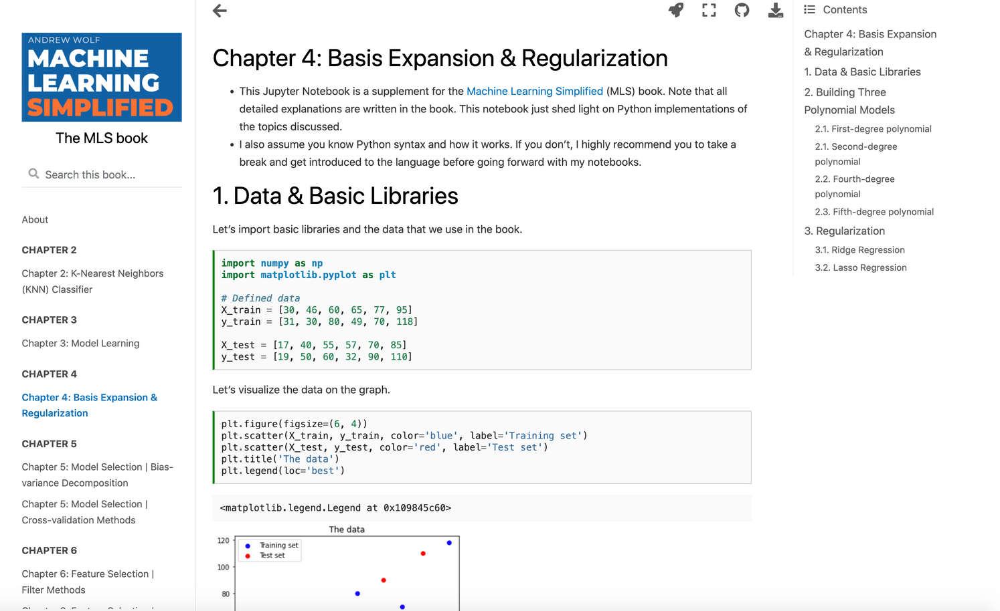

# About Jupyter-book 

This is a [Jupyter-book](https://jupyterbook.org/en/stable/start/create.html) version of the course content. Jupyter-book allows one to version-control the content in a proper way (.md instead of .ipynb), assure that all code is up-to-date (the book can be rebuilt with all code being re-run), it supports easy web-hosting with GitHub pages, quick Github integrations (opening an issue or a PR while reading), etc.  

## Building the book

To build the book:

- install all dependencies managed by [Poetry](https://python-poetry.org/docs/basic-usage/): `poetry install`
- execute `poetry run jupyter-book build jupyter_book`

This will create the [jupyter\_book/\_build/index.html](jupyter_book/_build/index.html) file (in the end of `jupyter-book` log you'll see a link to this file as well). Opening this in a browser shows smth like this:



Running the build multiple times will efficiently reuse cache. To make sure that all the code is up-to-date and working, you can manually remove the whole `jupyter_book/_build/` folder and execute `poetry run jupyter-book build jupyter_book` again. Depending on the amount of code this can take a while. Don't perform too heavy computation (e.g. hyperparam tuning) in a Jupyter book.

## How to add content to the book

Take a look at Markdown examples. You can generate this from a jupyter-notebook in the foolwing way:

 - run `jupyter-notebook` and open the desired notebook in the browser
 - download it as a Markdown file (File -> Download As -> Markdown (.md))
 - add a header that will say that the code in this markdown is executable, you can copy these 10 lines of code from any existing file, say from [jupyter\_book/book/chapter2/knn.md](jupyter_book/book/chapter2/knn.md)
 - replace all "```python" with "```{code-cell} ipython3" – this will assure that code blocks are executable

Then, place the markdown in the `book` folder and put a corresponding record into the table of contents – `_toc.yml` file. 
